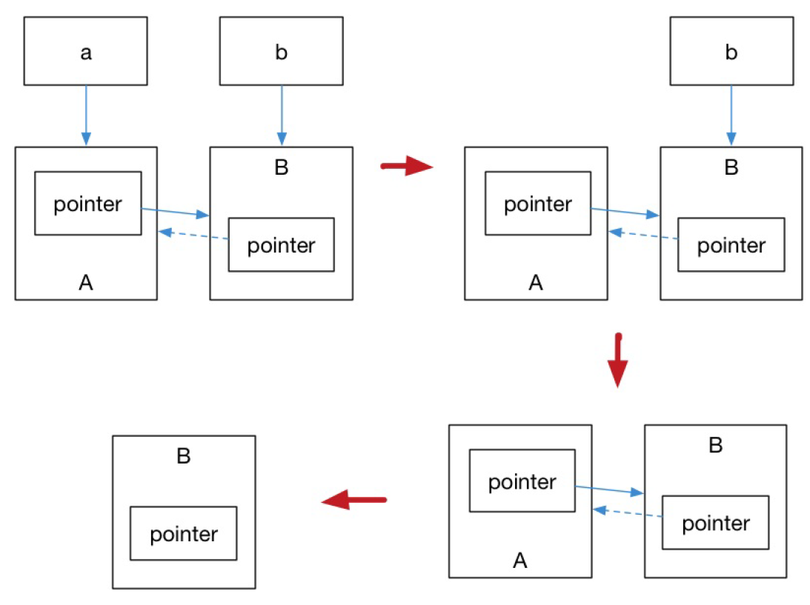

#C++11_tutorial_Learning
---
##五、对标准库的扩充：引用计数与智能指针
+ RAII与引用计数
	> 引用计数是为了防止内存泄露而产生的，基本想法是对于动态分配的对象，进行引用计数。
	> 每当增加一次对同一个对象的引用，那么引用对象的引用计数就会增加一次，每删除一次引用，引用计数就会减一；
	> 当一个对象的引用计数减为零时，就自动删除指向的堆内存。
	> RAII资源获取即初始化技术是为了防止资源泄露，在传统C++中使用```new```和```delete```去对资源进行申请和释放。
	> 在C++11中引入了智能指针的概念，使用了引用计数的想法；
	> 提供的智能指针包括```std::shared_ptr```/```std::unique_ptr```/```std::weak_ptr```，使用它们必须包含头文件```<memory>```。
+ std::shared_ptr
	> std::shared_ptr能够记录多少个share_ptr共同指向一个对象，从而消除显式地调用delete，当引用计数变为零时就会将对象自动删除。
	> 对应的std::make_shared能够用来消除显式地使用new，所以std::make_shared就会分配创建传入参数中对象，并返回这个对象类型的std::shared_ptr指针。
```
#include <iostream>
#include <memory>
void foo(std::shared_ptr<int> i)
{
	(*i)++;
}
int main()
{
	auto pointer = std::make_shared<int>(10);
	foo(pointer);
	std::cout << *pointer << std::endl;
	
	return 0;
}
```
	> std::shared_ptr可以通过get()方法来获取原始指针，通过reset()来减少一个引用计数，并通过get_count()来查看一个对象的引用计数。
+ std::unique_ptr
		> ```std::unique_ptr```是一种独占的智能指针，它禁止其他智能指针与其共享同一个对象，从而保证代码的安全：
		```
		std::unique_ptr<int> pointer = std::make_unique<int>(10);
		
		std::unique_ptr<int> pointer2 = pointer;
		```
	> make_unique的实现并不复杂:
	```
	template<typename T, typename ...Args>
	std::unique_str<T> make_unique(Args&& ...args){
		return std::unique_ptr<T>(new T( std::forward<Args>(args)... ) );
	}
	```
	> 可以利用std::move将该指针转移给其他的unique_ptr。
+ std::weak_ptr 弱引用指针
	- std::weak_ptr用于解决std::shared_ptr可能存在的造成内存泄露的问题。
	
	- 如上图所示，最后一步只剩下B，而B没有任何智能指针引用它，因此这块内存资源也会被释放。
	> ```std::weak_ptr```没有 * 运算符 和 ->运算符，所以不能够对资源进行操作，它的唯一作用就是用于检查```std::shared_ptr```是否存在。